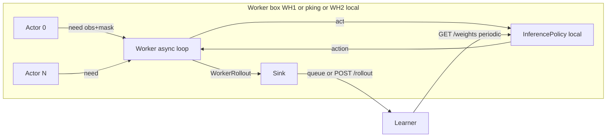

# Async actors on every distributed worker box

## Overview

Replace synced `SubprocVecEnv` on local and remote workers with the same desync actor fleet used by monolithic `train_parallel.py` / `async_fleet.py`, so each box recovers the ~30% step-collection gain. Inference stays **local** on the worker; only completed rollouts (and periodic weights) cross the network.

## Goal

Same agent count on one box → distributed worker step collection ≈ monolithic async fleet (target **≥95%**, not the current SubprocVecEnv path).

## Non-goals (this pass)

- Shrinking rollout HTTP payload (frames still uploaded; separate win).
- Changing learner PPO / HTTP protocol (`WorkerRollout`, `/rollout`, `/weights`).
- Making WH1 spawn work over bare SSH (still needs interactive session for BizHawk).

## Design

**Reuse, do not fork:** extract or call `_actor_process` / spawn helpers from [`D:\re1_rl\re1_rl\async_fleet.py`](D:\re1_rl\re1_rl\async_fleet.py). Worker host owns:

1. Spawn `n_envs` actors (pipes + `spawn`).
2. Local `InferencePolicy` (already warmed from learner).
3. Serve `need` → `predict_masked` → `act` (same as monolithic central loop).
4. On `rollout` messages: build `WorkerRollout` (`n_envs=1` per actor, or pack when convenient) and push to queue / `WorkerClient.upload_rollout`.
5. Weight sync unchanged (boundary + poll).

**Delete / stop using:** `_make_vec_env` + `collect_rollout` SubprocVecEnv path for production workers (keep behind `--sync-worker` only if cheap; otherwise delete to avoid two codepaths).

## Critical risks

| Risk | Mitigation |
|------|------------|
| Duplicating actor code → drift | Import `_actor_process` / `_wait_for_actor_spawn` from `async_fleet` (export if private) |
| Packing many 1-env rollouts floods learner | Match monolithic: accumulate to `batch_threshold` on learner; worker may upload per-actor rollouts as today async does internally |
| Local worker on WH2 competes with learner GPU | Same as monolithic: inference + train share GPU; optional CPU inference later |
| Assuming 97% before measuring | Smoke: one box, same `n_envs`, compare steps/s vs `train_parallel.py` async |

## Implementation todos

1. **Extract worker async loop** — new `re1_rl/distributed/async_worker_runtime.py` (or extend `worker_runtime.py`) that spawns actors, runs need/act/rollout against local `InferencePolicy`, sinks `WorkerRollout`.
2. **Wire distributed entry** — `_run_local_worker` / `_run_remote_worker` in [`D:\re1_rl\scripts\distributed_train_parallel.py`](D:\re1_rl\scripts\distributed_train_parallel.py) call async path instead of `_make_vec_env`.
3. **Export shared actor helpers** — make `_actor_process` / `_wait_for_actor_spawn` importable from `async_fleet` without circular imports.
4. **Tests** — unit test with stub pipes / fake actor messages (no BizHawk) proving masked predict + `WorkerRollout` assembly; keep existing mask tests.
5. **Docs** — update [`D:\re1_rl\docs\distributed_fleet_failure_analysis.md`](D:\re1_rl\docs\distributed_fleet_failure_analysis.md) and [`D:\re1_rl\docs\fleet_setup.md`](D:\re1_rl\docs\fleet_setup.md): workers are async actors, not SubprocVecEnv.
6. **Sync fleet** — commit, push, pull pking / WH1 / WH2.

## Implementation status

| Todo | Status |
|------|--------|
| Extract worker async loop | done — `re1_rl/distributed/async_worker_runtime.py` |
| Wire distributed entry | done — local + remote use `run_async_worker_loop` |
| Export shared actor helpers | done — import `_actor_process` / `_wait_for_actor_spawn` from `async_fleet` |
| Tests | done — `tests/test_async_worker_runtime.py` |
| Docs | done — fleet_setup + failure analysis |
| Sync fleet | pending after commit |

## Plan file

`D:\re1_rl\docs\async_workers_every_box.plan.md`
