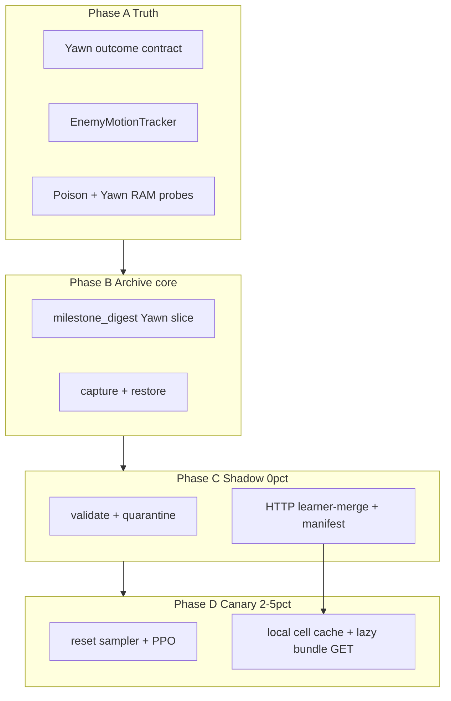

# Yawn-first campaign plan — Go-Explore lite + combat sensors

## North star

| Horizon | Goal |
|---------|------|
| **Short-term (NOW)** | Reach attic `210` and **beat Yawn's first encounter** (retreat or kill): `emblem → gold_emblem → shield_key → 20E → 210` |
| **Long-term (LATER)** | Full Jill Any% to helipad — see [Deferred (post-Yawn)](#deferred-post-yawn) |

This plan covers **Go-Explore archive resets**, **milestone digest cells**, **allocentric enemy motion**, and **fleet HTTP archive sync** — scoped to the Yawn chain. Underground, lab, Plant 42, and mansion revisit remain deferred.

**Non-goals (near-term):** button replay on reset, route/waypoint injection, RND/curiosity, BC pipeline, 20% archive mix before first Yawn clear, Samba/SCP as primary cell transport.

---

## GPT-5.6 critique (integrated)

**Verdict:** Go-Explore design is sound but was **over-scoped for Yawn-first**. Cut Samba-first fleet sync, 20% archive preset, midgame gate expansion, and generic robustification. Promote **sensor truth**, **Yawn outcome contract**, **enemy world velocity**, **short PB ladder**, **learner HTTP archive merge** (all 3 machines contribute), and **local 2–5% archive canary** before any scale-up.

**Key correction:** Enemy `world_vx/vz` alone does not fix “approaching me” — add **Jill world velocity** (+2 proprio) or the policy still confounds player motion with threat motion.

**Enemy motion vs Go-Explore order:** Motion tracker is **P0 before archive resets affect training**. Shadow capture (savestates only) can proceed in parallel; archive-weighted PPO waits until motion + restore validation pass.

---

## Go-Explore paradigm (mapped to RE1)

```text
1. SELECT  — pick frontier cell (path-filtered to Yawn rooms)
2. RETURN  — load savestate + sidecar (no learned return)
3. EXPLORE — PPO steps normally
4. UPDATE  — admit new/better cells after integrity gate
```

| Step | RE1 implementation |
|------|-------------------|
| Select | `GoExploreArchive.select_frontier(room_ids=YAWN_PATH_ROOMS)` |
| Return | `bridge.load_savestate()` + `apply_episode_sidecar()` |
| Explore | `env.step()` / MaskablePPO |
| Update | `go_explore_capture.maybe_capture_cell()` |

**Constraint:** archive only chooses episode start — never actions, trajectories, or route injection.



---

## P0 backlog (ordered — Yawn first encounter)

1. **Yawn outcome contract** — define contact, poisoned, damage, retreat/win, death for room `210` from RAM/events (not static roster alone). Module: `re1_rl/yawn_outcome.py`.
2. **Yawn eval harness** — held-out `20E` + multiple `210` bundles (entry, combat, poison, retreat). Extend [`eval_wing_harness.py`](D:\re1_rl\scripts\eval_wing_harness.py) or new `scripts/eval_yawn_harness.py`.
3. **Live Yawn sensor validation** — HP translate ([`yawn_hp.py`](D:\re1_rl\re1_rl\yawn_hp.py)), coords, `active_byte`, damage/kill edges, attack masks. BizHawk probes on QS saves.
4. **Poison validation** — `PLAYER_POISON` RAM, proprio edge, blue-herb cure, sidecar on reset.
5. **`EnemyMotionTracker`** — allocentric `world_vx`, `world_vz` per enemy slot from RAM `x`/`z` delta; track all 6 slots, encode top 5; reset on room change / load / discontinuity.
6. **Jill world velocity** — `player_world_vx`, `player_world_vz` in `proprio` (+2 dims). Total schema change: **+10 spatial, +2 proprio**. Checkpoint transplant / zero-init new dims.
7. **Yawn route almanac slice (C7)** — audit `105`, `10F`, `20E`, `210`: doors, shield-key gate, emblem chain, [`item_gates.md`](D:\re1_rl\docs\item_gates.md) rows for this slice only.
8. **Enable short PB ladder** — turn off typewriter-only gate for Yawn milestones: `key:*`, `story_use:*` (3 verified), `room:20E`, `room:210`, plus `yawn_contact` / `yawn_retreat` when detectors exist (`RE1_PB_V1_TYPEWRITER_ONLY=0` for ladder).
9. **Truthful Yawn curriculum bundles** — human or captured: post-Kenneth, post-piano, post-fireplace, shield at `20E`, `210` combat poses. Full sidecars. Merge bootstrap into this (no standalone bootstrap framework).
10. **`milestone_digest` Yawn slice** — `got`/`carry`/`use`(3 sites)/`event:kenneth_done`/`gallery:*` only; add Yawn event token only if it splits restorable states.
11. **Archive local core** — `go_explore_archive.py` v2, path-filtered frontier (`YAWN_PATH_ROOMS`), per-room cap, file lock.
12. **Capture + restore** — integrity gate, quality replace, atomic State+sidecar, load holdoff, [`validate_go_explore_archive.py`](D:\re1_rl\scripts\validate_go_explore_archive.py), quarantine.
13. **Unified reset sampler** — fresh + PB + archive; `RE1_GO_EXPLORE_RESET_WEIGHT` 0 → 0.02 → **0.05 max** until first Yawn clear.
14. **Yawn telemetry** — `20E` entry, `210` contact, poison, damage, retreat, death, `reset_source`; gate promotion on these, not mean reward.

### Yawn path room filter (archive frontier + digest scope)

Rooms on first-Yawn chain (from [`route_jill_anypct.json`](D:\re1_rl\data\route_jill_anypct.json) + attic):

```text
105, 104, 106, 107, 10F, 117, 11B, 10C, 10D, 102, 116, 202, 203, 205, 209, 20E, 210
```

Adjust as curriculum proves; **do not** archive underground/lab rooms until post-Yawn.

---

## Enemy world velocity (allocentric motion)

### Problem

Current `spatial` enemy slots are **egocentric position only** (`rel_x`, `rel_z`). When Jill walks, a stationary zombie's relative offset changes — the net cannot tell **it moved** vs **I moved**.

### Solution

| Signal | Source | Dims |
|--------|--------|------|
| `enemy{i}_world_vx`, `enemy{i}_world_vz` | Δ(enemy x,z) per env step, slot-keyed | +10 (`ENEMY_SLOTS=5`) |
| `player_world_vx`, `player_world_vz` | Δ(Jill x,z) per env step | +2 (`proprio`) |

Normalization: `clip(v / VEL_NORM, -1, 1)` with `VEL_NORM ≈ 512–1024` per policy step (account for `frame_skip=8`).

### `EnemyMotionTracker` (`re1_rl/enemy_motion.py`)

- `prev: dict[slot → (x, z, room_id)]` for all 6 RAM slots
- On each step after `decode_enemy_table`:
  - If room changed or slot position jumps > threshold → invalidate (velocity = 0)
  - If not `in_control` → freeze prev (no bogus deltas during cutscenes)
  - Else `vx = x - prev_x`, `vz = z - prev_z`
- Attach `world_vx`, `world_vz` to enemy dicts before [`SpatialEncoder._encode_enemies`](D:\re1_rl\re1_rl\spatial_encoder.py)
- Extend `_ENEMY_SLOT_FIELDS`; update [`test_enemy_encoder.py`](D:\re1_rl\tests\test_enemy_encoder.py)

### Gate (Phase A)

- Stationary enemy in fixed room → `world_vx ≈ world_vz ≈ 0` while Jill walks
- Walking zombie → non-zero world velocity
- Room transition / load savestate → velocities zero for one step
- Slot reuse spike → clamped or invalidated

**P0 before archive-weighted PPO.** Shadow capture does not need motion in savestates.

---

## Cell key + milestone digest (Yawn slice)

```text
v2|r=<ROOM>|x=<floor(x/4096)>|z=<floor(z/4096)>|m=<digest>
```

### Digest tokens (Yawn path only)

| Token | Source |
|-------|--------|
| `got:<item>` | `ever_held ∩ {lockpick, emblem, music_notes, gold_emblem, shield_key, armor_key, wind/sun/moon/star_crest}` — **only items reachable before Yawn matter**; full 10-item set OK |
| `carry:<item>` | current inventory ∩ gate items |
| `use:<site>` | `rewarded_story_uses ∩ {music_notes@10F_piano, emblem@10F_alcove, gold_emblem@105_fireplace}` |
| `event:kenneth_done` | `kenneth_cutscene_seen()` |
| `gallery:idle\|step:N\|retry_required\|complete` | `progress.gallery_*` |
| `event:yawn_contact` / `event:yawn_retreat` | **Add when Yawn contract lands** — only if they split cells |

**Not in digest:** `visited_rooms`, room deque, HP/ammo, cutscene raw keys, planner waypoint.

**Incremental:** add `use:` sites for chemical/crest/etc. **only when training reaches them** — not required for v1 Yawn path if `got:`/`carry:` suffice.

Implement in [`milestone_digest.py`](D:\re1_rl\re1_rl\milestone_digest.py) (new).

---

## Archive system (condensed)

### Modules (merged from GPT critique)

| Module | Role |
|--------|------|
| `milestone_digest.py` | tokens, `cell_key_v2` |
| `go_explore_archive.py` | v2 JSON, `select_frontier`, path filter |
| `go_explore_capture.py` | integrity + quality + atomic write; emit HTTP proposals |
| `go_explore_merge.py` | learner-side admit/replace from worker proposals |
| `go_explore_worker_cache.py` | manifest poll + lazy bundle cache on workers |
| `reset_curriculum.py` | `sample_reset_source()` → fresh \| PB \| archive |
| `go_explore_reset_wrapper.py` | replaces [`pb_reset_wrapper.py`](D:\re1_rl\re1_rl\pb_reset_wrapper.py) |

**Cut:** Samba/SCP-primary `go_explore_sync.py`, standalone `bootstrap_go_explore_cells.py` (merged into curriculum bundles), `production-20` preset.

**Fleet:** HTTP learner-merge via existing distributed port (8765) — see [Fleet HTTP archive sync](#fleet-http-archive-sync).

### On-disk layout

```text
data/go_explore/
  archive.json              # canonical on learner; workers use local_manifest.json
  local_manifest.json       # worker mirror of GET /go_explore/manifest
  cells/<record_id>/{cell.State, cell.sidecar.json, meta.json}
  quarantine/
```

### Capture / restore (unchanged core)

- Admit: stable control, alive, not Kenneth-terminal, atomic State+sidecar
- Replace within cell: HP → ammo → healing → slots → poison (lexicographic)
- Restore: reuse `env.reset(pb_bundle=...)`; post-load holdoff; validate no reward re-pay
- Cooldown: 60 steps; cap 40 cells/room

### Reset mix (Yawn canary)

```text
P(archive) = RE1_GO_EXPLORE_RESET_WEIGHT   # 0 → 0.02 → 0.05 (NOT 0.20 until post-Yawn)
P(pb)      = (1 - P(archive)) * existing PB mix
P(fresh)   = remainder — keep substantial fresh floor
```

### Training integration

- **Monolithic:** [`train_parallel.py`](D:\re1_rl\scripts\train_parallel.py) `make_env` → `GoExploreResetWrapper`
- **Async/distributed:** all machines roll out; **learner owns canonical `archive.json`** — no per-actor archive lock, no Samba on reset path

---

## Fleet HTTP archive sync

**Requirement:** workhorse1, pking, and workhorse2 all contribute discoveries and archive resets toward Yawn. **One PC doing all rollouts is unacceptable.** Consolidation is metadata + bundle delivery over the **existing learner HTTP surface** ([`learner_server.py`](D:\re1_rl\re1_rl\distributed\learner_server.py) port **8765**) — not Samba (Z:), not SCP as primary.

### Why not Samba / SCP

| Transport | Verdict |
|-----------|---------|
| **Samba (Z:)** | **No** for training-time sync — slow, many small files, must never load `.State` over SMB during `env.reset()` |
| **SCP/rsync** | **Interim fallback only** for bulk bundle backfill if HTTP bundle GET slips; still into **local cache**, never hot-path reads from share |
| **Learner HTTP** | **Yes** — same channel as `GET /weights` and `POST /rollout`; workers already talk to WH2 |

PB champions may keep optional async Samba under `RE1_PB_SHARED_ROOT`. Go-Explore uses a **different contract**: local cell cache + HTTP manifest/bundles.

### Architecture (hub on workhorse2)

```text
                    workhorse2 (learner)
                    ┌─────────────────────────────┐
  POST /rollout ──► │ merge capture proposals     │
  (capture in info) │ → archive.json + cells/     │
                    │                             │
  GET /go_explore/  │ canonical manifest + bundles│
      manifest      └───────────┬─────────────────┘
  GET /go_explore/bundle/{id}   │
                                │
         ┌──────────────────────┼──────────────────────┐
         ▼                      ▼                      ▼
    workhorse1              pking (dev)          WH2 local actors
    local cache/            local cache/         local cache/
    data/go_explore/        data/go_explore/     data/go_explore/
```

- **All 3 machines:** full env fleets, capture on discover, PPO rollouts unchanged.
- **Learner only:** admits/replaces cells, writes `archive.json` and `cells/<id>/` on disk.
- **Workers:** never write canonical archive; pull manifest + lazy-fetch bundles into **local cache**; `reset()` reads **local** paths only.

### Capture merge (push via existing rollout POST)

Workers attach capture proposals to rollout `info` (or a dedicated list in the rollout payload). Learner ingests on `POST /rollout` **after** rollout accept, same thread pool as today — no blocking actors on disk I/O beyond enqueue.

Proposal fields (minimum):

```json
{
  "go_explore_capture": [{
    "cell_key": "v2|r=20E|x=...|m=...",
    "record_id": "uuid",
    "quality": [hp, ammo, healing, slots, poison],
    "bundle_b64": "<optional: inline if small; else separate upload>",
    "state_sha256": "...",
    "sidecar_sha256": "...",
    "worker_id": "workhorse1",
    "captured_at_step": 12345
  }]
}
```

Learner-side `go_explore_merge.ingest_proposals()`:

1. Validate integrity gate (same rules as local capture).
2. Compare quality vs existing cell; replace if better.
3. Write bundle atomically under `data/go_explore/cells/<record_id>/` (reuse [`pb_bundle_io`](D:\re1_rl\re1_rl\pb_bundle_io.py) lock/staging pattern).
4. Update `archive.json` under file lock.
5. Bump `archive_version` (monotonic int) for manifest ETag.

**Phase C gate:** learner-merge live with `RE1_GO_EXPLORE_RESET_WEIGHT=0` — all machines feed the library before any archive reset.

### Manifest pull (catalog sync)

New endpoint on learner:

```http
GET /go_explore/manifest?since_version=<n>
```

Response:

```json
{
  "archive_version": 42,
  "cells": [
    {
      "record_id": "...",
      "cell_key": "v2|r=20E|...",
      "room_id": "20E",
      "quality": [8, 12, 2, 3, 0],
      "bundle_sha256": "...",
      "bytes": 1843200
    }
  ]
}
```

Worker daemon (`go_explore_worker_cache.py`):

- Poll every `RE1_GO_EXPLORE_MANIFEST_POLL_S` (default **60s**, same order as weight sync poll).
- Merge manifest into local index at `data/go_explore/local_manifest.json`.
- Do **not** download all bundles up front — lazy fetch on sample or background prefetch of frontier rooms.

### Bundle fetch (lazy local cache)

```http
GET /go_explore/bundle/<record_id>
```

- Returns `cell.State` + `cell.sidecar.json` + `meta.json` (zip or multipart; prefer **single application/octet-stream zip** per cell for one round-trip).
- Worker writes to `data/go_explore/cells/<record_id>/` via atomic staging (same as PB install).
- Cache hit: skip GET if `bundle_sha256` matches local `meta.json`.

**Reset path:** `GoExploreResetWrapper` resolves `record_id` → **local** `cells/<id>/` only. If missing, fall back to PB/fresh and enqueue background fetch — never block on SMB.

Optional: `POST /go_explore/bundle/<record_id>` for worker→learner upload when proposal too large for rollout POST (multipart); learner still sole writer to canonical tree.

### Client integration points

| Component | Change |
|-----------|--------|
| [`go_explore_capture.py`](D:\re1_rl\re1_rl\go_explore_capture.py) | Emit proposals in `info["go_explore_capture"]` |
| [`rollout_collect.py`](D:\re1_rl\re1_rl\distributed\rollout_collect.py) / codec | Serialize capture list in rollout batch |
| [`learner_server.py`](D:\re1_rl\re1_rl\distributed\learner_server.py) | `GET /go_explore/manifest`, `GET /go_explore/bundle/<id>`, merge on ingest |
| [`worker_client.py`](D:\re1_rl\re1_rl\distributed\worker_client.py) | `fetch_go_explore_manifest()`, `fetch_go_explore_bundle()` |
| `go_explore_worker_cache.py` (new) | Background manifest poll + lazy bundle cache |
| `go_explore_merge.py` (new) | Learner-side admit/replace from proposals |
| [`go_explore_reset_wrapper.py`](D:\re1_rl\re1_rl\go_explore_reset_wrapper.py) | Sample frontier from **local manifest**; load from local cache |

### Monolithic training

Single-box `train_parallel.py` uses local `archive.json` directly — no HTTP. Same capture/merge code paths; HTTP endpoints noop when `--role` is not distributed.

### Optional Z: mirror (debug only)

`RE1_GO_EXPLORE_SHARED_ROOT` may mirror **validated** cells to Samba for operator browsing — async, read-only from workers, **never** used for `reset()`. Not required for fleet correctness.

---

## Phased rollout (4 phases)

| Phase | Work | Archive reset % | Fleet HTTP |
|-------|------|-----------------|------------|
| **A — Truth** | Yawn contract, sensors, poison, `EnemyMotionTracker`, Jill velocity, C7 slice | 0% | — |
| **B — Archive core** | digest, short PB ladder, Yawn bundles, capture+restore code | 0% | — |
| **C — Shadow** | capture on, validate, quarantine, **learner-merge + manifest poll** | 0% | **required** (all 3 feed library) |
| **D — Canary** | unified sampler, telemetry, lazy bundle GET + local cache, 2% → 5% | 2–5% | **required** (archive resets from local cache) |

### Phase C exit (includes HTTP)

- `RE1_GO_EXPLORE_CAPTURE=1`, reset weight **0**
- Learner-merge accepting proposals from **all registered workers**
- `GET /go_explore/manifest` returns ≥25 distinct Yawn-path rooms
- Workers' `local_manifest.json` matches learner `archive_version` within one poll interval
- `validate_go_explore_archive.py`: ≥99.5% load pass, zero reward re-pay
- Does **not** require beating Yawn yet

### Phase D gate (before archive resets > 0)

- Lazy `GET /go_explore/bundle/<id>` verified on each worker (spot-load 5 cells)
- Archive reset sampler uses **local cache only**; fallback to PB/fresh if bundle missing

### Milestone gates (promotion)

1. Held-out `20E` → `210` contact rate from PB starts
2. `210` survival + damage from varied archive/PB starts
3. **First verified Yawn retreat/win**
4. First fresh-start full-chain win to Yawn
5. Only then: higher archive %, post-Yawn scope

---

## Explicit CUT list (near-term)

| Removed / deferred | Why |
|--------------------|-----|
| Samba-primary `go_explore_sync.py` | Replaced by learner HTTP merge + manifest/bundle GET |
| SCP-primary cell sync | Interim bulk backfill only; not fleet contract |
| `production-20` (20% archive) | Evidence-gated; post-Yawn |
| `expand-uses` midgame (hex_crank, doom books, chemical until needed) | Off Yawn path or add when stage reached |
| `expand-events` beyond Kenneth + Yawn | Post-probe only |
| Generic `robustify-eval` / wing eval | Replace with Yawn harness |
| Full BC / `train_bc.py` | Post-Yawn |
| Standalone bootstrap script | Merged into Yawn bundles |
| `go_explore_quality.py` as separate module | Inline in capture unless forced |
| World MLP 128→256 widen | P1 post-Yawn baseline |
| Broad `DOOR_FLAGS` map | Yawn-slice doors only |

---

## Deferred (post-Yawn)

- Hex crank, MO discs, underground, lab, Plant 42, guardhouse
- Mansion revisit, helmet key, hunters, Richard/serum
- Doom books, medals, courtyard crest slots (if not on critical path)
- Tyrant, helipad, full Any%
- Optional Samba mirror (`RE1_GO_EXPLORE_SHARED_ROOT`) for operator visibility only
- Archive share > 5%
- BC demonstrations
- Generic combat robustification campaign
- Network / world-MLP architecture changes beyond motion dims

---

## Configuration

| Variable | Default (Yawn campaign) |
|----------|-------------------------|
| `RE1_GO_EXPLORE_CAPTURE` | `0` → `1` in Phase C |
| `RE1_GO_EXPLORE_RESET_WEIGHT` | `0` → `0.02` → `0.05` cap |
| `RE1_GO_EXPLORE_ARCHIVE` | `data/go_explore/archive.json` (learner canonical; workers mirror via manifest) |
| `RE1_GO_EXPLORE_MANIFEST_POLL_S` | `60` — worker manifest refresh interval |
| `RE1_GO_EXPLORE_LEARNER_URL` | `http://192.168.0.116:8765` on remote workers |
| `RE1_GO_EXPLORE_SHARED_ROOT` | unset — optional async Samba mirror for debug only |
| `RE1_GO_TILE_SPAN` | `4096` |
| `RE1_GO_MAX_CELLS_PER_ROOM` | `40` |
| `RE1_PB_V1_TYPEWRITER_ONLY` | `0` when Yawn ladder enabled |
| `RE1_PB_*` | existing |

---

## Yawn-specific risks

| Risk | Mitigation |
|------|------------|
| False velocity spikes | Slot reuse, load settle, frame_skip — invalidate on jump |
| “Approaching” without Jill vel | **Both** enemy and player world velocity |
| Yawn retreat ≠ kill | Explicit retreat detector; don't use generic kill reward |
| Poison delayed across steps | Sidecar + holdoff; validate cure edge |
| One `210` savestate overfits pose | Multiple `210` bundles (entry, mid-fight, poisoned) |
| Archive dead-end inventory | Quality scorer: ammo + healing at capture |
| Digest too coarse (pre/post fireplace) | 3 `use:` sites + `carry:`/`got:` |
| Fresh-start floor collapsed | Monitor `reset_source` mix explicitly |
| Schema migration | Sync actor/learner obs spaces; zero-init new dims |
| Split-brain archives | Learner sole writer; workers read local cache from manifest |
| Bundle missing at reset | Fallback PB/fresh + background GET; never read SMB |
| Large capture in rollout POST | Optional `POST /go_explore/bundle` side channel |

---

## Implementation todos

| id | Task | Phase | Status |
|----|------|-------|--------|
| `yawn-outcome-contract` | `yawn_outcome.py` — contact/retreat/poison/death | A | pending |
| `yawn-eval-harness` | Held-out `20E`/`210` eval script | A | pending |
| `yawn-sensor-suite` | Live RAM probes for Yawn HP, coords, active_byte | A | pending |
| `poison-validate` | End-to-end poison obs + cure | A | pending |
| `enemy-motion-schema` | `enemy_motion.py` + spatial +10 dims + tests | A | done |
| `player-world-velocity` | +2 proprio dims + obs schema version | A | done |
| `yawn-route-truth` | C7 audit dining/bar/attic slice | A | pending |
| `enable-yawn-ladder` | PB milestones + `RE1_PB_V1_TYPEWRITER_ONLY=0` | B | pending |
| `truthful-yawn-bundles` | Curriculum savestates + sidecars for chain | B | pending |
| `digest-yawn-slice` | `milestone_digest.py` + tests | B | done |
| `archive-local-core` | `go_explore_archive.py` v2 + path filter + tests | B | done |
| `capture-restore-core` | capture, integrity, validate script, holdoff | B–C | done |
| `go-explore-merge` | `go_explore_merge.py` — learner ingest from rollout proposals | C | done |
| `go-explore-http-api` | `GET /go_explore/manifest`, `GET /go_explore/bundle/<id>` on learner | C | done |
| `go-explore-worker-cache` | `go_explore_worker_cache.py` — manifest poll + lazy local cache | C–D | done |
| `unified-path-sampler` | `reset_curriculum.py` + wrapper + `make_env` | D | done |
| `yawn-telemetry` | reset_source, Yawn metrics in info/logs | D | pending |
| `yawn-canary-2-5` | Ramp archive weight to 5% after gates | D | pending |

### Build order

```text
Phase A: yawn-outcome → sensors/poison → enemy-motion + player-velocity → route-truth
Phase B: digest → archive → bundles + PB ladder → capture-restore
Phase C: shadow capture + validate + learner-merge + manifest HTTP (all 3 machines)
Phase D: worker local cache + lazy bundle GET → sampler + telemetry → canary 2-5%
```

---

## Test matrix

| Test | Covers |
|------|--------|
| `test_milestone_digest.py` | Yawn token set |
| `test_enemy_motion.py` | stationary vs moving, room reset |
| `test_enemy_encoder.py` | +world_vx/vz fields |
| `test_go_explore_archive.py` | path filter, frontier |
| `test_go_explore_capture.py` | admit/replace |
| `test_reset_curriculum.py` | mix weights |
| `test_pb_sidecar.py` | bundle round-trip |
| `test_go_explore_merge.py` | proposal admit/replace on learner |
| `test_go_explore_http.py` | manifest versioning, bundle round-trip |
| `test_go_explore_worker_cache.py` | lazy fetch, sha256 skip, missing fallback |
| BizHawk smoke | `validate_go_explore_archive.py --smoke` |

---

## Related docs

- Yawn strategy: [`08_yawn_without_restart.md`](D:\re1_rl\docs\nn_architecture_review\08_yawn_without_restart.md)
- PB vs archive: [`10_pb_capture_and_curriculum_mix.md`](D:\re1_rl\docs\nn_architecture_review\10_pb_capture_and_curriculum_mix.md)
- Prior art Go-Explore: [`prior_art_and_stealable_ideas.md`](D:\re1_rl\docs\prior_art_and_stealable_ideas.md)
- Item gates: [`item_gates.md`](D:\re1_rl\docs\item_gates.md)
- Enemy RAM: [`enemy_ram_hunt.md`](D:\re1_rl\docs\enemy_ram_hunt.md)

---

## Plan file

`D:\re1_rl\docs\go_explore_milestone_digest.plan.md`
