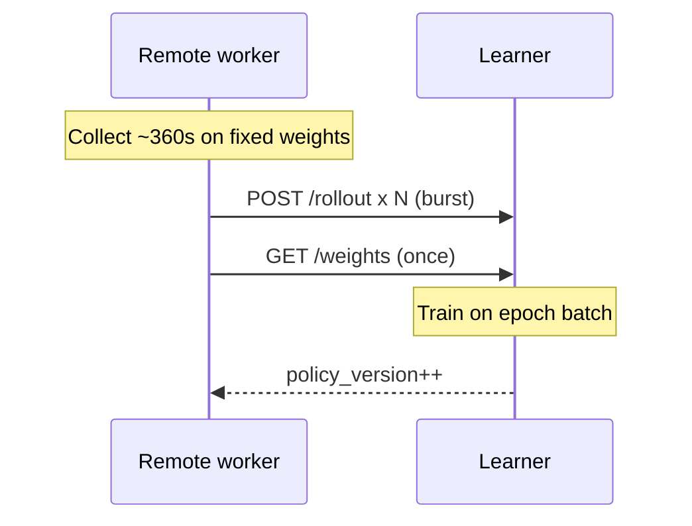

# Six-minute PPO sync epochs (holistic)

## Overview

Change distributed training so remotes touch the network **once per ~6 minutes**: upload all experience gathered that epoch, then download new weights. Tune PPO hyperparams for the resulting large on-policy batches. Local WH2 worker stays in-process (no HTTP) but follows the same epoch cadence for train/publish.

## Why

PPO is sensitive to policy lag. Drip-feeding rollouts while weights update every train step (or pulling weights every few minutes while still uploading continuously) mixes off-policy data. Epoch-aligned sync keeps each worker’s buffer on **one** `policy_version`, then refreshes.

## Design

| Knob | Value | Role |
|------|-------|------|
| `sync_interval_s` | **360** | Worker buffer + flush + weight pull |
| `train_interval_s` | **360** | Learner trains on pending, then publishes |
| `max_staleness` | **1** | Only current/prev version (epoch-aligned) |
| `learning_rate` | **1e-4** | Down from 3e-4 for ~5–10× larger batches |
| `n_epochs` | **2** | Less overfit on huge buffers |
| `batch_size` | **2048** | Larger minibatches |
| `n_steps` | **256** | Unchanged per-actor horizon |

Monolithic `train_parallel.py` / `PPO_HYPERPARAMS` unchanged.

## Critical risks

- **Under-full first epoch** if workers stagger — learner trains on whatever is pending after interval (min 1 rollout).
- **RAM on worker** holding ~6 min of frames — expect hundreds of MB–GB per remote; monitor pking.
- **Stale reject** if learner trains twice before a slow worker flushes — `max_staleness=1` + worker flush-before-pull order.

## Implementation status

| Todo | Status |
|------|--------|
| Worker buffer + flush/pull every sync_interval | done |
| Learner timed train + DISTRIBUTED_EPOCH_HYPERPARAMS | done |
| Launchers / docs / tests / fleet sync | in progress |

## Plan file

`D:\re1_rl\docs\six_minute_ppo_sync_epochs.plan.md`
