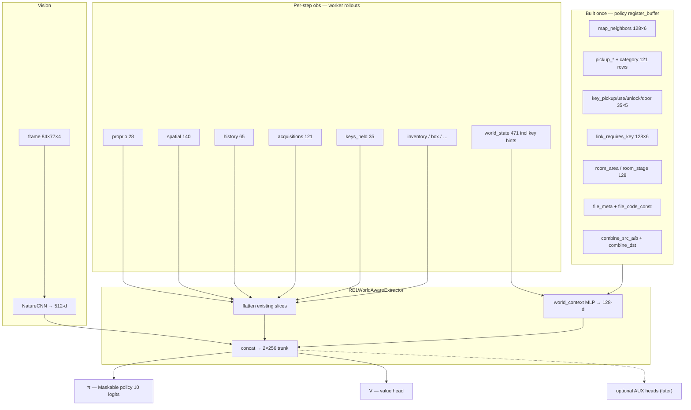

# World-Aware NN Architecture — RE1 Jill PPO

**Date:** 2026-07-17  
**Status:** implemented on `feature/world-almanac-extractor` — `features_dim=1587`; graft zip `data/ppo_re1_world_almanac_graft.zip`  
**Plan:** [static_world_map_obs_57f02d1c.plan.md](file:///c:/Users/phili/.cursor/plans/static_world_map_obs_57f02d1c.plan.md)  
**Purity doctrine:** [north_star.md](north_star.md)

---

## Decision

**Flat MaskablePPO + `RE1WorldAwareExtractor` — no learned high-level room/order head.**

The policy remains a single end-to-end actor–critic. A custom features extractor fuses the existing NatureCNN trunk with flattened privileged vectors and a small world-context MLP that joins **frozen** Evil Resource almanac buffers with **dynamic** per-step masks. There is no hierarchical RL manager, no separate room-routing head, and no macro planner selecting low-level actions.

---

## Architecture diagram

**Forward path (summary):** pixels → CNN 512-d; legacy flattened obs slices unchanged in role; static `WorldCatalog` buffers gathered at `current_room` and masked by dynamic `world_state` / `key_hints`; inventory joins `file_*` / `combine_*` recipe availability; 1–2 layer MLP → 128-d `world_context`; concat → shared 2×256 MLP → policy and value heads.

---

## Memory efficiency — static vs dynamic split

| Layer | Where it lives | Rollout / replay |
|-------|----------------|------------------|
| **Static almanac** | `register_buffer(..., persistent=False)` on policy (`RE1WorldAwareExtractor`), built deterministically from JSON at init | **Not** serialized per step or in checkpoints. Rebuilt via `reload_world_catalog_buffers()` when the learner loads a policy checkpoint from the same data files. |
| **Dynamic masks** | Env encoders (`world_state_encoder`, `encode_key_hints`) | **Yes** — small tensors only (`world_state`, `key_hints`). Workers ship these keys in the obs dict; distributed codec unchanged. |
| **Learner replay** | PPO rollout buffer | Stores dynamic obs keys only. Learner does **not** need static catalog floats in the replay blob — the policy already holds them. |

**Why:** the full mansion catalog is ~few KB of floats — trivial next to CNN weights, but wasteful to duplicate across thousands of parallel env steps. One copy in the network; episode-local state stays small.

**Checkpoint note:** static buffers are part of the policy state dict (or rebuilt identically from data on load). Transplant scripts zero-init new MLP / flatten slices when resuming older checkpoints.

---

## Observation keys

Shared vocabulary: **`room_index`** = sorted keys from `data/rooms.json`, padded to 128. **`item_id`** = `memory_map.ITEM_IDS` ordinals (`/ 0x4B`). Pickup catalog rows are **(room, item) instances** (119 rows after dedup), not unique item names.

### Existing keys (unchanged role)

| Key | Shape | Role |
|-----|-------|------|
| `frame` | 84×77×4 uint8 | stacked grayscale vision |
| `proprio` | (28,) | body / room / control state |
| `goal` | (27,) | **zeroed** during exploration training per [north_star.md](north_star.md) |
| `spatial` | (128,) → grows with exit `to_room` / `requires_key` | egocentric items, enemies, exits, interactables |
| `visited` | (16, 16, 1) | episode-local cell trace |
| `rooms_visited` | (128,) | episode one-hot over room table |
| `box` | (34,) | item-box slots + room flag (qty `/ AMMO_QTY_NORM=255`) |
| `inventory` | (16,) | on-person 8 slots (qty `/ AMMO_QTY_NORM=255`) |
| `weapon_card` | (12,) | equipped clip, nominal dmg, round type, boss-room bonus flags |
| `last_attack` | (16,) | one-step attack memory (hit, clip before/after, HP events, height one-hot neutral/up/down); cleared next step |
| `history` | (65,) | room deque K=32 |
| `acquisitions` | **(121,)** | last **K=60** pickups: pairs `(item_id, room_idx)` → 121-d (**shipped**) |
| `room_enemies` | (12,) | static roster counts for current room |
| `keys_held` | (35,) | ever-held key-item bitmask |
| `cutscene_ledger` | (16,) | milestone cutscene bits |
| `milestones` | (12,) | derived episode milestones |
| `maps_files` | (16,) | map/file pickup RAM bitfield |

Current fusion baseline (pre–world-state): **1448-d** into 2×256 trunks (`policy_config.py`).

### New keys

| Key | Shape | Role |
|-----|-------|------|
| `world_state` | **(471,)** | dynamic mansion memory: `pickup_active[119]`, `pickup_gated`, `room_remaining[128]`, `room_key_remaining`, `key_pickup_pending[35]`, `key_use_pending`, `key_affordant_here`, optional scalars |
| `key_hints` | (105,) = 35×3 | dynamic key relevance only: `key_pickup_pending`, `key_use_pending`, `key_affordant_here` per `KEY_ITEM_NAMES` index (location data lives in static buffers) |

### Deprecated

| Key | Was | Replacement |
|-----|-----|-------------|
| `affordances` | (40,) — top-8 held keys, BFS `path_hint`, `len(name)/32` id proxy | **`key_hints` + static `key_*` buffers** in `WorldCatalog`. Remove from obs after transplant. |

### `acquisitions` detail

- **K = 60** (was 4): ordered log of last 60 `(item_id, room_idx)` pairs.
- **121-d** encoding in `episode_history.py` — **already shipped**.
- Complements set-membership channels (`pickup_active`, `keys_held`): acquisitions preserve **order**; masks preserve **membership**.

### `spatial` extension (bridge to topology)

Per exit slot (+3 fields): `exitN_to_room`, `exitN_known`, `exitN_requires_key` — links ego door bearings to `map_neighbors` and `link_requires_key`.

---

## Static buffer inventory (`WorldCatalog`)

Built once via `WorldCatalog.from_files(...)`; registered as **non-trainable** `register_buffer(..., persistent=False)` tensors on `RE1WorldAwareExtractor` (reloaded from JSON on checkpoint load).

| Buffer group | Shape (representative) | Content |
|--------------|------------------------|---------|
| **Topology** | `map_neighbors (128, 6)`, `map_degree (128,)` | outbound neighbor `room_index` per room; pad 127; degree / 6 |
| **Room tags** | `room_area (128,)`, `room_stage (128,)` | ER map section enum; normalized `rooms.json` stage |
| **Pickup catalog** | `pickup_room_idx`, `pickup_item_id`, `pickup_category`, `pickup_key_flag`, `pickup_gate_type`, `pickup_requires_mask (119, 35)` | 119 ER rows; category: key / recovery / ammo / weapon / file / misc |
| **Key hints (static)** | `key_pickup_room`, `key_use_room`, `key_unlock_room`, `key_door_from`, `key_item_id` — each `(35,)` | all `KEY_ITEM_NAMES` rows; indexes align with `keys_held[i]` |
| **Door links** | `link_requires_key (128, 6)` | same slot order as `map_neighbors`; key index or 127 = free |
| **Files** | `file_room_idx (F,)`, `file_id (F,)`, `file_code_const (F, C)` | ER file locations + numeric constants (Pass Number, door codes) — facts, not auto-entry |
| **Combine graph** | `combine_src_a`, `combine_src_b`, `combine_dst (R,)` | herb mixes + chem / V-JOLT chain; policy still learns COMBINE menu |

Extractor gathers neighbor row for `proprio.room_index`, dots `pickup_active` against static catalog rows, joins `keys_held` with `pickup_requires_mask` for newly reachable pickups, exposes held-file passcode constants via `file_code_const`, and marks combine recipes whose `src_a`/`src_b` are both in inventory.

---

## Why V exists

PPO needs a **critic** to estimate state value \(V(s)\) for advantage computation (\(A_t = R_t + \gamma V(s_{t+1}) - V(s_t)\) with GAE). The value head shares the fused representation with the policy head but does not select actions. It is standard actor–critic structure, not a separate “planner.” Optional auxiliary heads (e.g. reward decomposition) may attach later at the fusion layer; they are not in scope for v1.

---

## Transplant notes

When upgrading from pre–world-aware checkpoints:

1. **Graft** existing NatureCNN weights and all flatten slices whose dims are unchanged.
2. **Zero-init** new channels: `world_context` MLP, any new flatten width from `world_state` / `key_hints`, and spatial exit extension dims.
3. **Rebuild** static buffers from data files on extractor init — no weight transplant needed for buffers (deterministic).
4. **Remove** `affordances` from obs dict and fusion math after cutover.
5. Use `scripts/transplant_guidebook_obs.py` (planned) for slice-accurate weight copy + acquisitions widen already handled.

Checkpoint break triggers: new extractor class, `spatial` dim bump, `world_state` / `key_hints` keys, `acquisitions` 9→121 (latter already shipped).

---

## Explicit non-goals

Do **not** implement as part of this architecture:

| Non-goal | Rationale |
|----------|-----------|
| **Enemy spawn catalog from ER** | Live in-room enemy hooks / `spatial` enemy slots only |
| **Learned HRL manager** | flat policy; no room-order or sub-policy head |
| **Route compass / `goal` re-enable** | north star: no baked any% GPS during exploration training |
| **Puzzle macros** | crow gallery, piano, MO terminal auto-sequences — policy learns buttons |
| **Chris-only / Arranged data** | Jill Standard only |
| **269 RDT-only room nodes in v1** | stay on 116-room `room_index` table |
| **Anonymous event-flag bitfields in obs** | reward / ledger only until named |
| **Auto-combine / auto-enter-code** | combine graph is sensor; actuation stays learned |

---

## Related documents

- **Implementation plan:** [c:\Users\phili\.cursor\plans\static_world_map_obs_57f02d1c.plan.md](file:///c:/Users/phili/.cursor/plans/static_world_map_obs_57f02d1c.plan.md)
- **DRL purity / guidebook doctrine:** [north_star.md](north_star.md) — privileged data describes **what the world is**; the policy learns **how to act**. Static full-mansion buffers amend “current-room only” for **static** facts only; per-step obs remains small dynamic masks plus existing egocentric channels.
- **Field-level privileged spec:** [privileged_obs_spec.md](privileged_obs_spec.md)
- **Prior NN summary:** [nn_architecture_and_encoding.md](nn_architecture_and_encoding.md)
